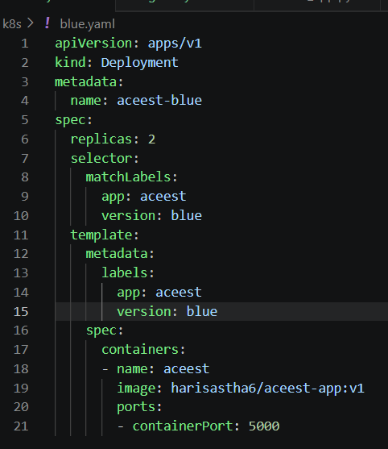
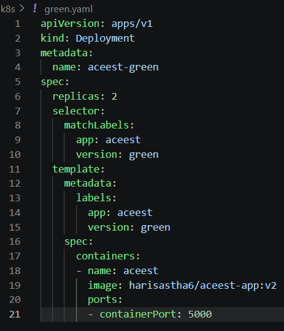

# ACEest DevOps CI/CD Pipeline

## 📌 Project Overview

This project implements a complete DevOps CI/CD pipeline for a fitness management system using Flask.

## 🚀 Technologies Used

* Flask (Web Application)
* Git & GitHub (Version Control)
* Jenkins (CI/CD Pipeline)
* Docker (Containerization)
* Docker Hub (Container Registry)
* Kubernetes / Minikube (Deployment & Orchestration)
* Pytest (Testing)
* SonarQube (Code Quality)

---

## 🔄 CI/CD Pipeline Flow

1. Developer pushes code to GitHub
2. Jenkins triggers build automatically
3. Pytest runs automated tests
4. Docker image is built and pushed to Docker Hub
5. Kubernetes deploys the application
6. Deployment strategies ensure zero downtime

---

## 🐳 Docker Image

Docker Hub Repository:
https://hub.docker.com/r/harisastha6/aceest-app

---

## ☸️ Kubernetes Deployment

* Deployment using Minikube
* Service exposed via NodePort
* Scalable architecture using replicas

---

## 🔁 Deployment Strategies Implemented

* Rolling Update
* Blue-Green Deployment
* Canary Deployment
* Rollback Mechanism

---

## 🧪 Testing

* Unit testing implemented using Pytest
* Automated testing integrated in CI pipeline

---

## 📸 Screenshots

(Add screenshots of:)

* Running application (v1 & v2)

* Kubernetes pods

* Docker images

* Deployment strategies
Blue :

Green :

---

## 🎯 Outcome

Successfully built an end-to-end automated CI/CD pipeline ensuring:

* Faster deployment
* High reliability
* Zero downtime updates
