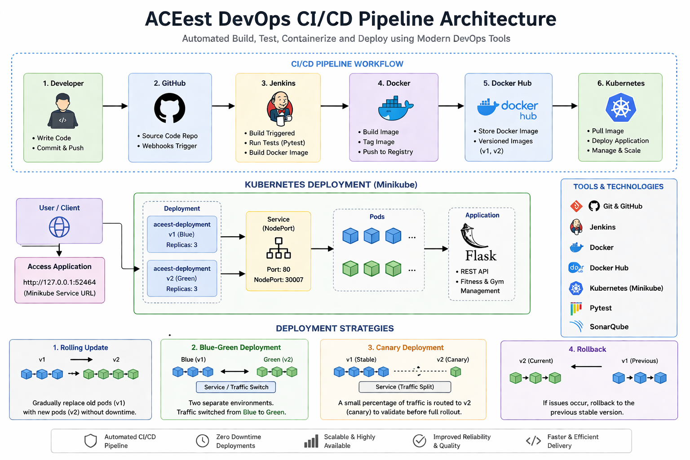
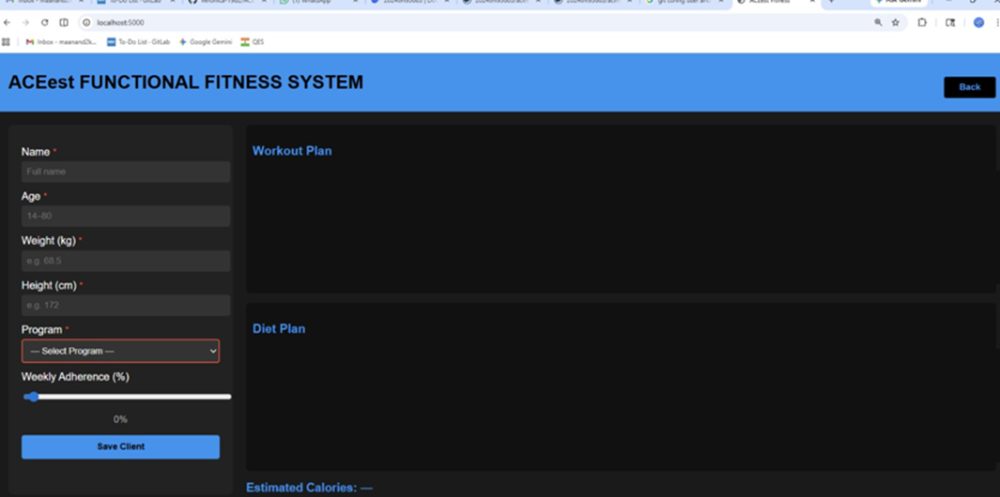
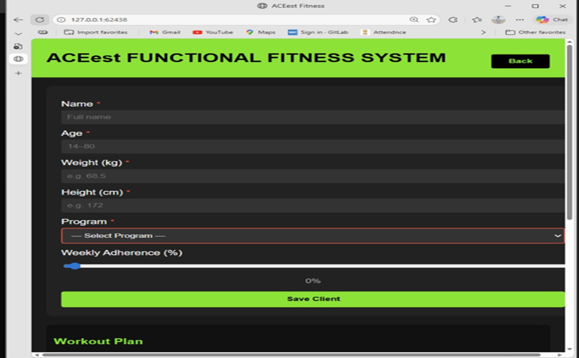
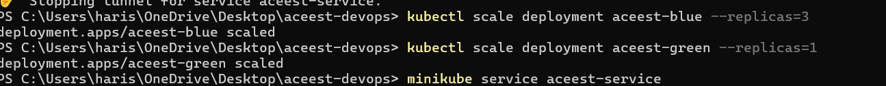

# ACEest DevOps CI/CD 

[Python] [Docker] [Kubernetes] [CI/CD] [Tests] [Build Passing]

## 📌 Project Overview

This project demonstrates an end-to-end DevOps CI/CD pipeline for a fitness management system built using Flask.
It showcases modern practices including containerization, automated testing, and Kubernetes-based deployment with zero-downtime strategies.

## 🏗️ Architecture
Developer → GitHub → Jenkins → Docker → Docker Hub → Kubernetes (Minikube)

## 🚀 Technologies Used

* Flask (Web Application)
* Git & GitHub (Version Control)
* Jenkins (CI/CD Pipeline)
* Docker (Containerization)
* Docker Hub (Container Registry)
* Kubernetes / Minikube (Deployment & Orchestration)
* Pytest (Testing)
* SonarQube (Code Quality)

---

## 🔄 CI/CD Pipeline Flow

1. Code is pushed to GitHub
2. Jenkins triggers build automatically
3. Pytest runs automated tests
4. Docker image is built
5. Image is pushed to Docker Hub
6. Kubernetes deploys the application
7. Deployment strategies ensure zero downtime

---

## 🐳 Docker Hub Image

Docker Hub Repository:
https://hub.docker.com/r/harisastha6/aceest-app

---

## ☸️ Kubernetes Deployment

* Deployment using Minikube with multiple Replicas
* Service exposed via NodePort
* Scalable architecture 
* Accessible using Minikube service

---

## 🔁 Deployment Strategies Implemented

* Rolling Update
    - Gradual update from v1 → v2
    - No downtime during deployment
* Blue-Green Deployment
    - Two environments (blue & green)
    - Traffic switched using service selector
* Canary Deployment
    - Controlled rollout using replica scaling
    - ~75% traffic → v1
    - ~25% traffic → v2
* Rollback Mechanism
    - Revert to previous stable version using Kubernetes

---

## 🧪 Testing

* Unit testing implemented using Pytest
* Automated testing integrated in CI pipeline
* Validates API endpoints
* Ensures application reliability

---

## 📸 Screenshots

* Running application (v1 & v2)

* Kubernetes pods

* Docker image

* Minikube

* Deployment strategies (Blue and Green) :

---
* Deployment scaling(75% and 25%)

## ⚠️ Challenges & Solutions

* Docker setup issues → resolved with proper configuration
* Kubernetes YAML errors → fixed indentation & syntax
* Service selector mismatch → corrected labels
* Image naming issues → used proper Docker tags

## 🎯 Outcome

Successfully built an end-to-end automated CI/CD pipeline ensuring:

* Automated CI/CD pipeline implementation
* Scalable and containerized application
* Faster deployment
* High reliability
* Zero downtime updates

📌 Conclusion

This project demonstrates how DevOps practices enable efficient, reliable, and scalable software delivery using automation and container orchestration.

👨‍💻 Author

Hari Sastha S
GitHub: https://github.com/harisastha6